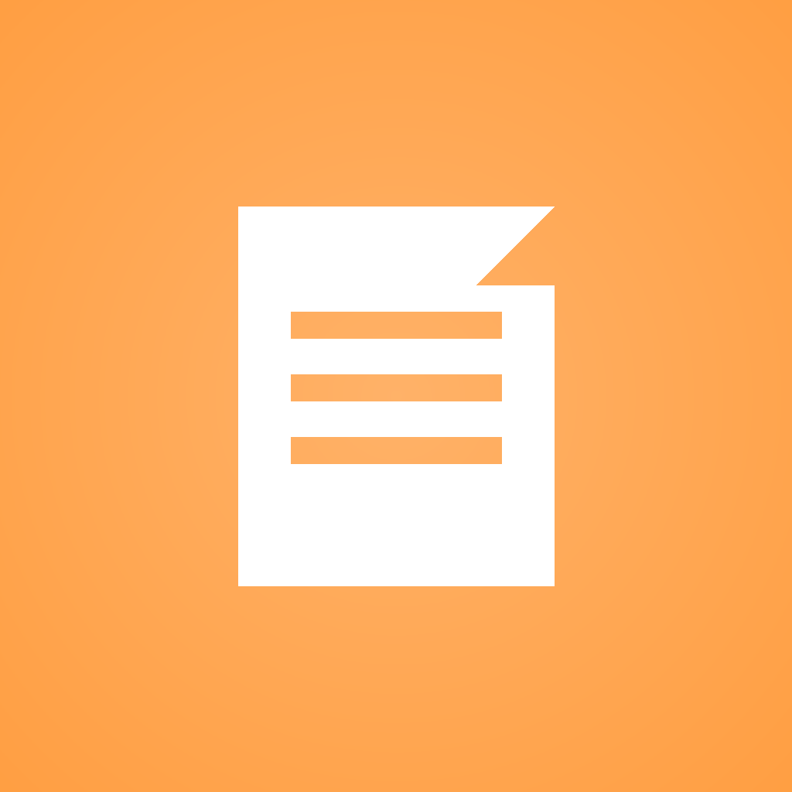
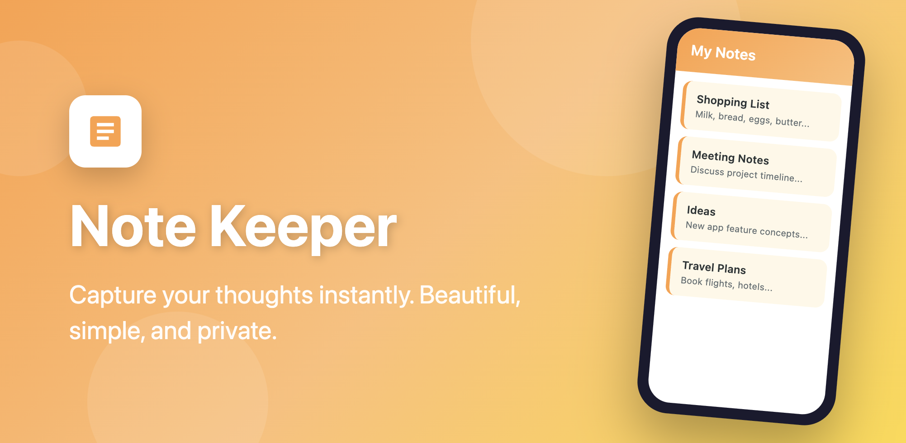
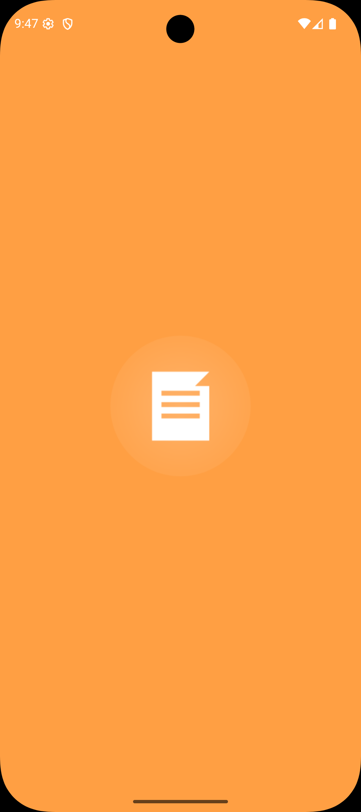
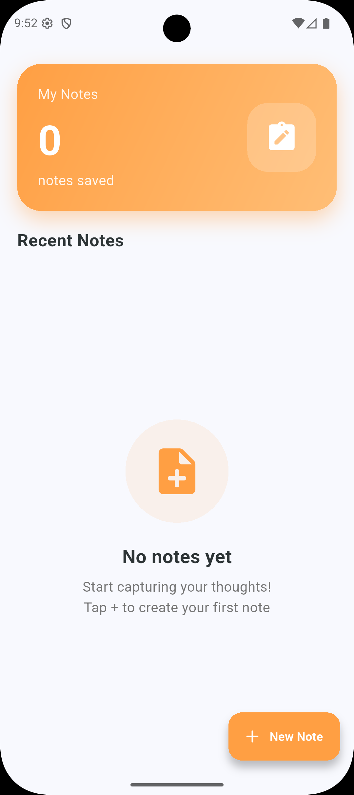
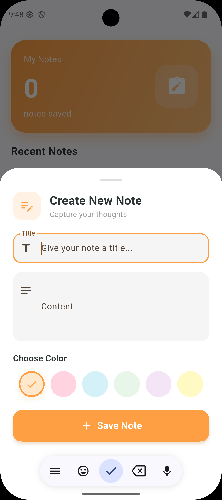
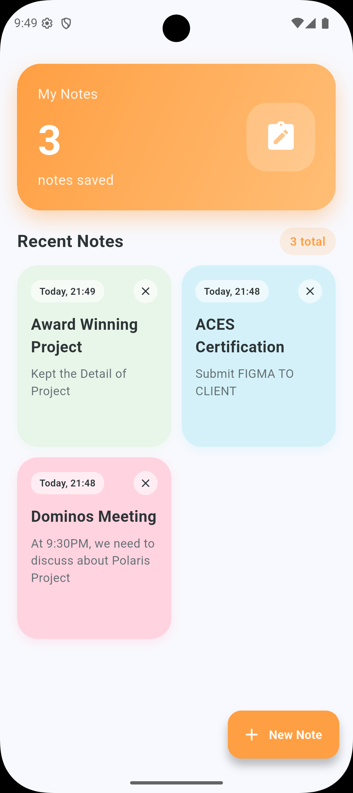

<p align="center">
  
</p>

<h1 align="center">Note Keeper</h1>

<p align="center">
  A beautiful and simple note-taking app built with Flutter
</p>

<p align="center">
  
  
  
</p>

<p align="center">
  
</p>

---

## Features

- Create colorful notes with 6 color options
- Grid layout for easy viewing
- Swipe to delete notes
- Local storage - your notes stay on your device
- Beautiful Material Design 3 UI

## Screenshots

<p align="center">
  
  
  
  
</p>

## Tech Stack

- Flutter 3.10+
- Dart
- Material Design 3

## Installation

```bash
cd note_keeper
flutter pub get
flutter run
```

## Build APK

```bash
flutter build apk --release
```

## Privacy

Note Keeper stores all data locally on your device. No data is collected or transmitted.

## License

This project is licensed under the MIT License - see the [LICENSE](LICENSE) file for details.

---

<p align="center">
  Made with Flutter
</p>
